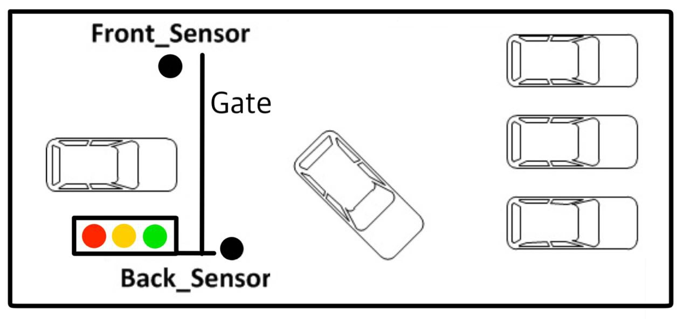
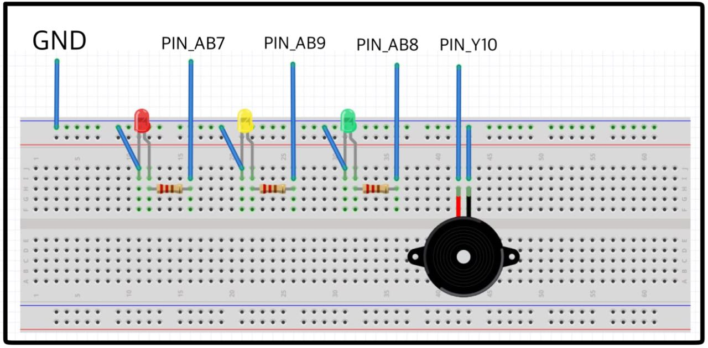
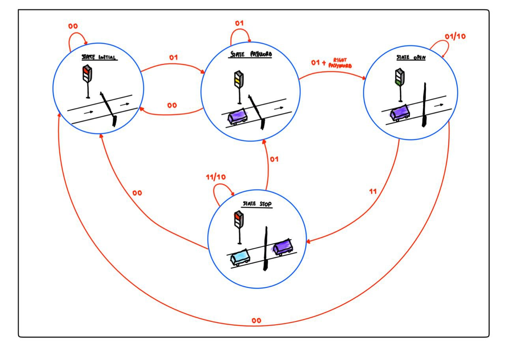
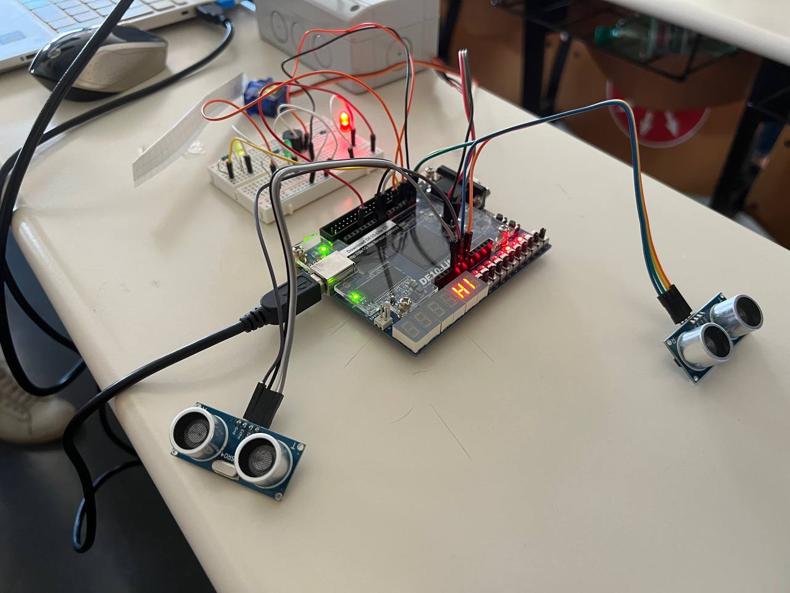

<!-- 

# parking_lot_system_FPGA
Realization of a VHDL based system of a parking lot

-->

# 🅿️ Car Parking System (VHDL Implementation)

A **VHDL-based car parking system** implemented on the **Altera DE10-Lite FPGA board**, designed as the final project for the *Digital Programmable Systems* course.

---

## 🚗 Overview

This project focuses on the design and implementation of a **smart car parking system** using **VHDL**.  
The system monitors parking availability through **ultrasonic sensors**, controls the **servo barrier**, and provides **visual and acoustic feedback** using LEDs and a buzzer.

  

---

## 🧰 Technologies

- 
- 
- 

---

## ⚙️ System Description

The car parking system is based on a **Mealy finite state machine** with four main states, displayed on the **7-segment display** of the DE10-Lite board.  
The system interacts with the environment through various components:

- Two **HC-SR04 ultrasonic sensors** (front and back)
- One **SG-90 servo motor** controlling the gate
- One **passive buzzer**
- Three **LEDs** (red, yellow, green) with 220 Ω resistors  
- A **breadboard** for sensor and actuator wiring

  

The logic has been entirely described in VHDL, simulated, and then synthesized in Intel Quartus Prime Lite Edition.  
The **Mealy state machine** manages transitions between the system’s states according to sensor input.

  

---

## 🧪 Results

The final implementation successfully reproduces the expected parking behavior on the **DE10-Lite** board:

- Correct state transitions displayed on 7-segment indicators  
- Smooth servo gate motion  
- Reliable detection from ultrasonic sensors  
- Visual and sound feedback confirming each state  

  

---

## 📁 Repository Structure

📦 car_parking_system_vhdl
- src/ # VHDL source files
- image/ # Project images (schematics, FSM, implementation)
- docs/ # Project documentation
- README.md # Project overview

---

## 👥 Authors

Developed by [Francesco Savino](https://github.com/FrankSav80) and [Tommaso Savino](https://github.com/ItsTomSav)  
Master’s Degree in Automation and Robotics Engineering – Politecnico di Bari

---

## 🧠 Keywords

`VHDL` • `FPGA` • `Finite State Machine` • `Embedded Systems` • `Digital Design`
